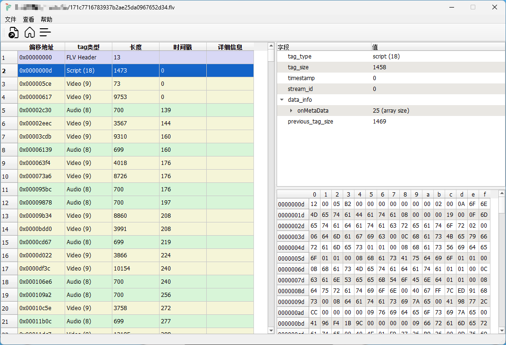

# FLV 解析器

一个基于 Qt 的 FLV 文件解析和编辑工具。



## 功能特性

- 加载并解析 FLV 文件格式
- 支持元数据(metadata)解析，包括 AMF 格式数据的处理
- 支持文件修改：删除tag、修改二进制字节

## 安装说明

### 系统要求

- 支持 Windows系统，macOS 和 Linux 未测试
- Qt 5.15 或更高版本
- CMake 3.16 或更高版本
- C++17 兼容的编译器

### 编译步骤

1. 克隆仓库：

   ```bash
   git clone https://github.com/yourusername/flv-parser.git
   cd flv-parser
   ```

2. 创建构建目录：

   ```bash
   mkdir build
   cd build
   ```

3. 配置并编译：

   ```bash
   cmake ..
   cmake --build .
   ```

4. 运行程序：

   ```bash
   ./flv-parser
   ```

## 许可证

本项目采用 MIT 许可证发布。详情请参阅 [LICENSE](LICENSE) 文件。
