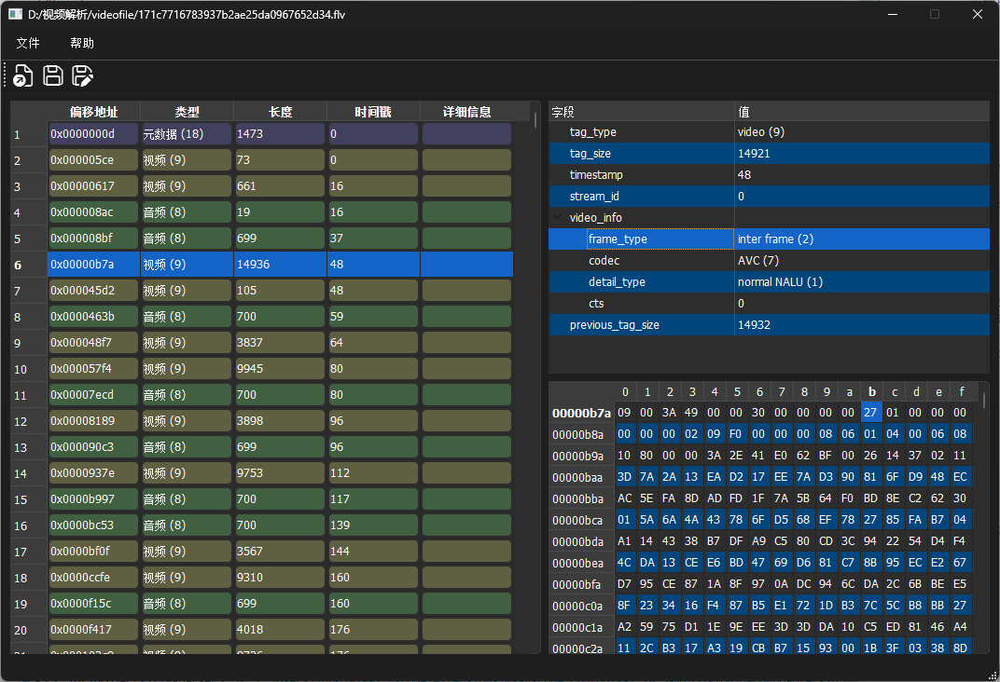

# FLV 解析器

一个基于 Qt 的 FLV 文件解析工具，用于查看和分析 FLV 视频文件的内部结构。



## 功能特性

- 加载并解析 FLV 文件格式
- 显示帧列表信息，包括偏移地址、类型、长度、时间戳等
- 支持音频帧和视频帧的详细信息展示
- 支持元数据(metadata)解析，包括 AMF 格式数据的处理
- 使用树形结构展示帧的详细信息
- 支持 H.264/H.265/H.266等 视频帧头解析
- 支持 AAC 音频帧头解析
- 支持文件修改：删除选中帧

## 安装说明

### 系统要求

- 支持 Windows、macOS 和 Linux 系统
- Qt 5.15 或更高版本
- CMake 3.16 或更高版本
- C++17 兼容的编译器

### 编译步骤

1. 克隆仓库：
   ```
   git clone https://github.com/yourusername/flv-parser.git
   cd flv-parser
   ```

2. 创建构建目录：
   ```
   mkdir build
   cd build
   ```

3. 配置并编译：
   ```
   cmake ..
   cmake --build .
   ```

4. 运行程序：
   ```
   ./flv-parser
   ```

## 已知问题

- 某些复杂的 AMF 对象可能无法完全解析
- 大文件加载可能性能较慢

## 许可证

本项目采用 MIT 许可证。详情请参阅 [LICENSE](LICENSE) 文件。
